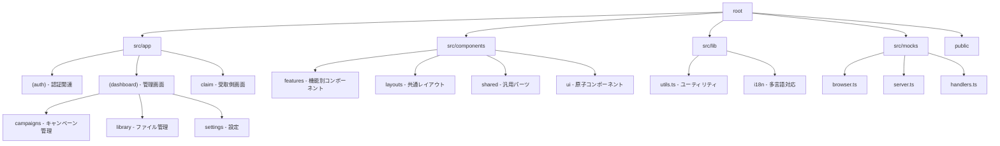

# プロジェクト構成と役割の定義

このドキュメントでは、本プロジェクトのフォルダ・ファイル構成とその役割について説明します。

## 1. 視覚的構成図 (Mermaid)

---

## 2. フォルダ・ファイルの役割

### `src/app` (Next.js App Router)
アプリケーションのルーティングとページを管理します。
- **`(auth)`**: ログインや会員登録など、認証が必要なページのグループです。
- **`(dashboard)`**: ライバー（配布側）が使用するメインの管理画面です。
  - `campaigns`: 配布キャンペーンの作成・管理を行います。
  - `library`: アップロードしたファイルの一覧管理を行います。
  - `dashboard`: 全体状況のサマリーを表示します。
- **`claim`**: リスナー（受取側）がファイルを受け取るための専用ページです。
- **`layout.tsx`**: アプリケーション全体のルートレイアウト（フォント、テーマ設定など）を定義します。
- **`globals.css`**: Tailwind CSSを含む、アプリケーション全体のスタイル定義です。

### `src/components` (UIコンポーネント)
UIを構成するパーツを管理します。
- **`features`**: 特定の機能（例：キャンペーン作成、ファイルアップローダー）に密接に関連する、ビジネスロジックを含むコンポーネントです。
- **`layouts`**: サイドバー、ヘッダー、フッターなど、ページの骨組みとなるコンポーネントです。
- **`shared`**: ローディング、モーダル、トーストなど、プロジェクト全体で再利用される汎用的なコンポーネントです。
- **`ui`**: ボタン、入力フォーム、カードなど、shadcn/uiに基づいた最小単位のUI部品です。

### `src/lib` (ライブラリ・ユーティリティ)
共有のロジックや定数、設定ファイルを管理します。
- **`utils.ts`**: Tailwind CSSのクラス結合（clsx/tailwind-merge）などの汎用ユーティリティです。
- **`i18n`**: 多言語対応のための設定や辞書ファイルです。

### `src/mocks` (モックサービス)
APIのモック（MSW: Mock Service Worker）を定義します。
- バックエンド未実装の状態でも、フロントエンド開発を並行して進めるためのダミーAPIを提供します。

### `src/instrumentation.ts`
Next.jsの実行時フックです。現在は開発環境でのAPIモック（MSW）の起動に使用されています。

### ルートディレクトリの重要ファイル
- **`要件定義.md`**: プロジェクトのビジョン、機能要件、技術スタックがまとめられた最上位ドキュメントです。
- **`next.config.ts`**: Next.jsの動作設定（環境変数、画像ドメイン許可など）を記述します。
- **`package.json`**: プロジェクトの依存関係と実行スクリプトを定義します。
- **`AGENTS.md`**: AIエージェント（私）向けのプロジェクト固有のルールです。
